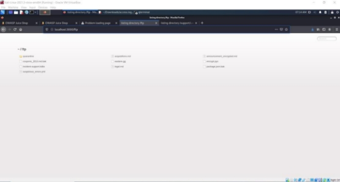
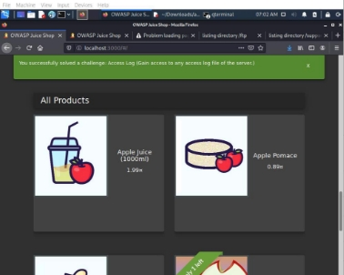

**TUGAS                 KEAMANAN JARINGAN** 

**“A09: SECURITY LOGGING AND MONITORING FAILURES”** 

Disusun Oleh kelompok A9 D4 LJ IT B : 

1. Mega Putri Rahmawati Darta (3122640038) 
1. Akhmad Mufti Ali Wafa (3122640048) 

**POLITEKNIK ELEKTRONIKA NEGERI SURABAYA TAHUN AJARAN 2022/2023** 

1. **PENDAHULUAN** 

Berdasarkan OWASP Top 10 2021, kategori Security Logging and Monitoring Failures membantu dalam mendeteksi, mengeskalasi, dan menanggapi pelanggaran aktif. Tanpa pencatatan (logging) dan pemantauan (monitoring), pelanggaran tidak dapat dideteksi. Pencatatan deteksi harusnya dapat terjadi saat :  

- Login berulang kali yang gagal  
- Peringatan dan kesalahan akan menghasilkan pesan log yang tidak memadai  
- Peringatan dan respons yang tidak ada  

Berikut merupakan daftar klasifikasi CWE pada kategori A9 ini : 

- CWE-117 Improper Output Neutralization for Logs  

Memungkinkan penyerang memalsukan entri log atau konten berbahaya ke dalam log. Terjadi ketika : 

1. Data memasuki aplikasi dari sumber yang tidak terpercaya 
1. Data ditulis ke file log aplikasi atau sistem  
- CWE-223 Omission of Security-relevant Information  Aplikasi  tidak  merekam  atau  menampilkan  informasi  yang  penting  untuk mengidentifikasi sumber atau sifat serangan atau menentukan apakah suatu Tindakan tidak aman. 
- CWE-532 Insertion of Sensitive Information into Log File  
  - Informasi  yang  ditulis  ke  file  log  dapat  bersifat  sensitive  dan  memberikan panduan  berharga  bagi  penyerang  atau  mengekspos  informasi  pengguna  yang sensitive 
  - Meskipun  mencatat  semua  informasi  mungkin  berguna  selama  tahap pengembangan,  penting  agar  tingkat  pencatatan  diatur  dengan  tepat  sebelum produk dikirimkan sehingga data pengguna yang sensitive dan informasi sistem tidak terpapar ke penyerang. 
- CWE-778 Insufficient Logging 
1. Perangkat tidak merekam peristiwa tersebut atau menghilangkan detail penting tentang peristiwa tersebut saat mencatatnya 
1. Peristiwa penting keamanan tidak dicatat dengan benar, seperti Upaya login yang gagal berkali-kali. 

Dalam percobaan kali ini, kali mencoba 2 percobaan yaitu :  

1. Mengakses access log file dari server (masuk ke dalam CWE-532 dikarenakan file penting dari server dapat diakses oleh penyerang) 
1. Login dengan username yang benar dengan menggunakan password yang didapatkan dari file access log yang sudah tersebar. (masuk ke dalam CWE-778 dikarenakan percobaan  login  berulangkali  dengan  kesalahan  username  dan  password  tidak dihiraukan dan tetap bisa memasukkan username dan password yang lainnya). 
2. **PERCOBAAN MENDOWNLOAD FILE ACCESS LOG** 
1. Mempersiapkan juice shop  

2. Menggunakan FFUF 

Penjelasan  :  FFUF  merupakan  alat  untuk  melakukan  fuzzing  pada  aplikasi  web. Fuzzing adalah proses pengujian perangkat lunak yang melibatkan pengiriman input yang  tidak  valid,  acak,  atau  tidak  terduga  ke  aplikasi  target,  dengan  tujuan menemukan kelemahan atau kerentanan yang dapat dieksploitasi. 

FFUF  dapat  digunakan  untuk  fuzzing  URl,  parameter,  wordlist  generator,  filter response, dan pemetaan aplikasi web. Berikut merupakan contoh perintah FFUF :  

3. Menjalankan perintah FFUF untuk fuzzing URL 

Penjelasan :  

Menjalankan perintah berikut ini :  

“ffuf -w /usr/share/wordlists/dirb/common.txt -u [ http://localhost:3000/FUZZ”](http://localhost:3000/FUZZ) 

Perintah  tersebut  digunakan  untuk  menjalankan  URL  dengan  url  tambahan  yang diambilkan  dari  wordlist  “usr/share/wordlists/dirb/common.txt”.  Wordlist  tersebut berisi daftar kata yang umum digunakan untuk menguji dan mencari direktori atau file yang ada pada server web. Wordlist umum ini biasanya mencakup beberapa nama file umum, direktori umum, atau jalur URL yang sering digunakan dalam aplikasi web. 

Dari hasil diatas didapatkan status 200 dan size nya 1987 semua. Disini saya akan mencoba menerapkan salah satu string diatas pada browser, seperti gambar dibawah ini :  

Pada gambar diatas , mencoba mengakses localhost:3000/1000 , dan ternyata untuk halaman yang ditampilkan adalah list product. Dikarenakan pada hasil sebelumnya status  dan size nya sama, hal  ini memungkinkan bahwa  juice shop memang  bisa menerima url lain namun diarahkan ke list product.  

4. Menjalankan fuzzing url dengan menambahkan perintah “-fs” 

Penjelasan : dikarenakan pada hasil sebelumnya didapatkan size sama 1987 maka dilakukan perintah -fs 1987 untuk menampilkan yang selain size tersebut.  

Setelah didapatkan hasilnya, maka dapat dicoba pada browser sebagai berikut :  

Percobaan pertama /assets tidak didapatkan hasil apapun, selanjutnya mencoba url yang kedua yaitu /ftp dan didapatkan hasil berikut ini :  

Penjelasan : Dari hasil diatas didapatkan beberapa file, salah satu file yang mungkin bisa  mendapatkan  informasi  lebih  detail  jika  dicari  tau  lebih  dalam  adalah  file support.  

Sehingga langkah selanjutnya adalah mencari url yang mengandung /support dengan cara berikut ini : 

Pada  hasil  pertama  didapatkan  string  “Logs”,  dan  jika  dijalankan  pada  browser didapatkan tampilan berikut ini :  

Penjelasan : File tersebut dapat didownload dan jika dillihat isinya seperti gambar diatas.  File  ini  sangat  penting  dan  bersifat  rahasia  karena  memberikan  informasi penting tentang aktivitas akses ke sistem. 

Jika kembali ke juice shop, sudah didapatkan alert berhasil menyelesaikan access log. 

3. **PERCOBAAN LOGIN DENGAN USERNAME DAN PASSWORD REAL** 
1. Dump File di internet 

Sebelum melakukan percobaan ini dibutuhkan untuk mencari file access log juice shop yang ada di internet. Dapat diakses melalui link berikut ini :  

<https://pastebin.com/4U1V1UjU>

Dalam access log tersebut ditemukan salah satu aktivitas mengganti password dengan menggunakan metode GET dan URL berikut ini:  

"GET /rest/user/change-password?current=0Y8rMnww$\*9VFYE%C2%A759- !Fg1L6t&6lB&new=sjss22%@%E2%82%AC55jaJasj!.k&repeat=sjss22%@%E2%82%AC55jaJasj!.k8 HTTP/1.1" 

Dari URL tersebut dapat dianalisa untuk password yang lama adalah :  

0Y8rMnww$\*9VFYE%C2%A759-!Fg1L6t&6lB 

Dan jika dilihat dari password tersebut, terdapat “%C2%A7” yang memungkinkan bahwa password tersebut sudah di encoding, sehingga untuk mendapatkan password yang asli perlu untuk mendecode : 

Dengan menggunakan tools diinternet kemudian didapatkan hasil decode password adalah 0Y8rMnww$\*9VFYE§59-!Fg1L6t&6lB 

2. Login admin untuk mengetahui list email user 

Penjelasan  :  Masuk  ke  user  admin  dengan  menggunakan  sql  injection,  kemudian masuk  ke  halaman  /administration  dan  dapat  kita  lihat  terdapat  list  email  yang dimiliki oleh user 

3. Mencoba mencocokkan username dan password menggunakan burp-suite Memasukkan list email yang didapatkan pada username.txt : 

Mencari pada http history dan mengirimkan pada intruder :  

Pada intruder, membuat email menjadi variabel dengan menambah $ seperti gambar dibawah ini : 

Berpindah pada tabs payload dan menginputkan file username.txt pada simple list: 

Hasil  :  tidak  didapatkan  response  200  pada  semua  list  username.  Saat  ditelusuri terdapat  perubahan  password  yang  diinputkan  hal  ini  kemungkinan  dikarenakan password berisi karakter “$”. 

5\.  Mencoba mencocokkan secara manual  

Hasil : Email yang memiliki password tersebut adalah[ J12934@juice-sh.op ](mailto:J12934@juice-sh.op)

4. **HAL-HAL YANG DILAKUKAN UNTUK PENCEGAHAN** 
1. Memastikan semua login, control akses, dan kegagalan validasi input sisi server dapat dicatat dengan konteks pengguna yang memadai untuk mengidentifikasi akun yang mencurigakan 
1. Pastikan  transaksi  memiliki  jejak  audit  dengan  control  intgeritas  untuk  mencegah gangguan atau penghapusan pada database 
1. Pastikan data log dikodekan dengan benar untuk mencegah injeksi atau serangan pada sistem logging atau pemantauan  
1. Memiliki pemantauan dan peringatan yang efektid sehingga aktivitas mencurigakan terdeteksi dan ditanggapi dengan cepat. 
