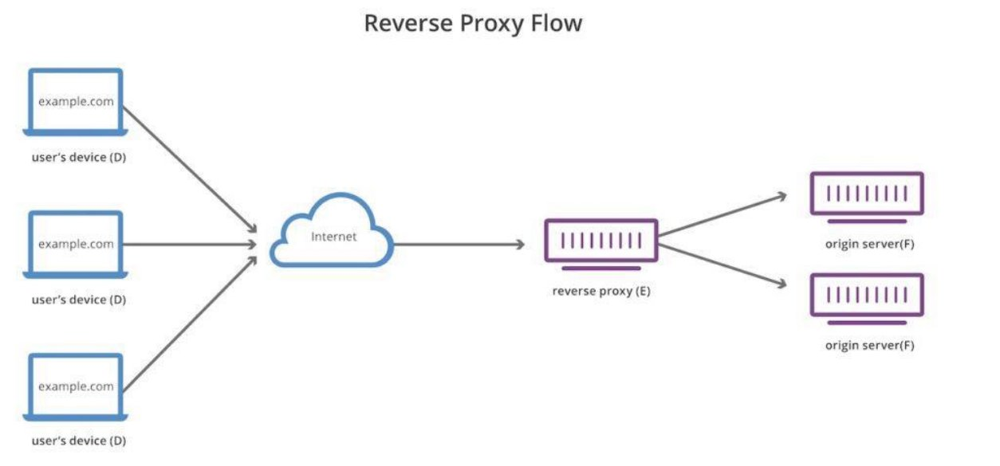

TEKNOLOGI REVERSE PROXY DAN LOAD BALANCING

K E L O M P O K  A 9

3 1 2 2 6 4 0 0 3 8  -  M e g a  P u t r i  R a h m a w a t i  D a r t a 3 1 2 2 6 4 0 0 4 8  -  A k m a d  M u f t i  A l i  W a f a

REVERSE PROXY

1 

Fitur/modul di dalam sebuah webserver, yang  berfungsi untuk melakukan port forwarding  suatu request, dari public request menuju ke  dalam sistem. 

FUNGSI REVERSE PROXY 

Menerima dan meneruskan  request dari client ke server atau  sebaliknya. 

CARA KERJA

PENJELASAN CARA KERJA

Step 1 Step 2 Step 3

Client yang ingin mengakses  Request yang diberikan client  Setelah itu Reverse Proxy akan suatu website.  sebelum sampai ke server akan  meneruskan ke server dan 

diterima oleh reverse proxy  kemudian menerima balasan dari terlebih dahulu.  server yang nantinya akan disampaikan ke client.

CONTOH

Beberapa web server yang memiliki kemampuan reverse proxy.

Apache / HTTPD

Nginx ( n-gin-x, baca en-jin-x /engine-x ) Haproxy

CONTOH DIAGRAM 

Semua webserver akan selalu memiliki fitur VirtualHost. VirtualHost akan memetakan nama panggil (server name), ke dalam document root dalam sebuah server. Dengan menggunakan VirtualHost, sebuah server dengan satu IP dapat melayani banyak nama panggil.

LOAD BALANCING

2 

Merupakan proses pendistribusian traffic atau  lalu lintas jaringan secara efisien ke dalam  sekelompok server, atau yang lebih dikenal  dengan server pool atau server farm. 

FUNGSI 

LOAD BALANCING

Berguna untuk salah satu server  dari website yang mendapatkan  banyak lalu lintas kunjungan tidak  mengalami kelebihan beban. 

CARA KERJA

Step 1 Step 2 Step 3

Pengguna meminta akses masuk  Load balancer menerima  Jika salah satu server sudah 

ke server. permintaan tersebut dan  hampir penuh, load balancer akan mendistribusikan lalu lintas  mengalihkan lalu lintas tersebut ke 

tersebut ke beberapa server. server lain yang masih tersedia.

JENIS

Berdasarkan konfigurasinya, load balancing dapat dibagi menjadi tiga jenis, yaitu:

Hardware Load Balancer

Hardware Load Balancer merupakan perangkat load balancing yang berbentuk perangkat keras dapat mendistribusikan permintaan lalu lintas jaringan berdasarkan pengaturan yang diterapkan. Diletakkan bersamaan dengan server di pusat data lokal karena bentuknya yang fisik. 

Software Load Balancer

Berdasarkan konfigurasinya, load balancing dapat dibagi menjadi tiga jenis, yaitu:

Hardware Load Balancer Software Load Balancer

Software Load Balancer termasuk ke dalam perangkat load balancing yang berbentuk perangkat lunak. Artinya, load balancer ini dapat dipasang secara digital pada server. Terdapat dua jenis Software Load Balancer, yaitu komersial dan open source.

Virtual Load Balancer
JENIS

Berdasarkan konfigurasinya, load balancing dapat dibagi menjadi tiga jenis, yaitu:

Hardware Load Balancer Software Load Balancer Virtual Load Balancer

Gabungan dari dua jenis perangkat load balancing sebelumnya. Load balancer ini mengombinasikan kedua jenis load balancer sebelumnya ke dalam mesin virtual. Anda akan mendapatkan Hardware Load Balancer yang dipasang sebagai perangkat lunak di dalam mesin virtual.

THANK YOU
