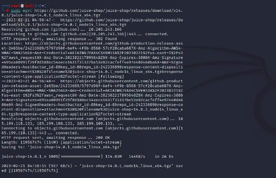
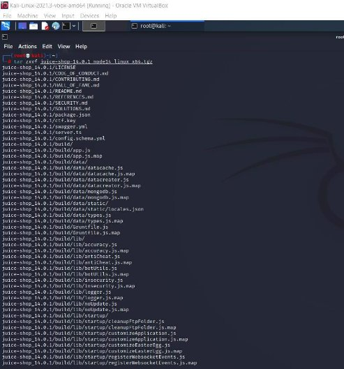
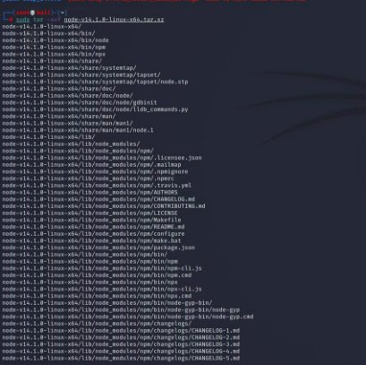
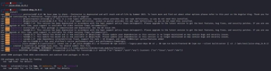
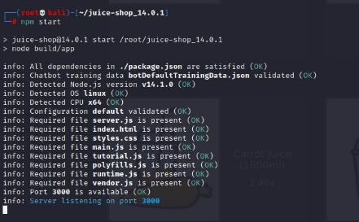
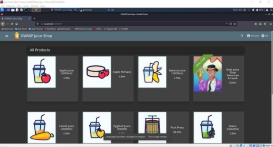

**TUGAS                  KEAMANAN JARINGAN “OWASP 10 JUICE SHOP”** 

Nama : Mega Putri Rahmawati Darta 

Kelas : D4 LJ IT B 

NRP  : 3122640038 

**POLITEKNIK ELEKTRONIKA NEGERI SURABAYA TAHUN AJARAN 2022/2023** 

**PROSES INSTALL OWASP JUICE SHOP KALI LINUX** 

1. Download OWASP Juice Sop  

Tahapan :  

- Buka virtual box, jalankan kali linux yang sudah terpasang  
- Buka terminal kali dan masuk ke root dengan perintah “sudo -i” 
- Jika sudah masuk root, lanjutkan jalankan perintah  

“sudo wget https://github.com/juice-shop/juice-shop/releases/download/v14.0.1/juice- shop-14.0.1\_node14\_linux\_x64.tgz 

- Cek hasil download dengan perintah “ls” 

Dari  gambar  diatas  dapat  dilihat  bahwa  saya  sudah  berhasil  mendownload  file installasi juice shop 

- Jalankan  perintah  “tar  zxvf  juice-shop-14.0.1\_node14\_linux\_x64.tgz”  untuk mengekstrak zip yang sudah didownload pada proses sebelumnya 

Kembali  cek  isi  direktori,  pada  gambar  dibawah  ini  sudah  terdapat  folder  hasil ekstrak 

2. Install NodeJS dan NPM 
- Untuk install Node.Js dan NPM download file dengan cara menjalankan perintah berikut  di  terminal  “sudo  wget  https://nodejs.org/download/release/v14.1.0/node- v14.1.0-linux-x64.tar.xz” 

- Jika proses sudah selesai, coba cek direktori dengan perintah “ls”, maka dapat dilihat terdapat 1 file zip yang baru saja didownload. 

- Melakukan extraksi pada file yang baru saja didownload, dengan perintah “sudo tar - xvf node-v14.1.0-linux-x64.tar.xz” 

- Jika proses ekstraksi sudah selesai, cek kembali hasil ekstraksi dengan perintah “ls” 

Dari gambar diatas, dapat dilihat bahwa file zip installasi sudah berhasil diekstrak. 

- Jika sudah berhasil terekstrak, maka pindahkan folder tersebut didalam folder “usr”. Dapat  dilakukan  dengan  perintah   berikut  “sudo  cp  -r  node-v14.1.0-linux- x64/{bin,include,lib,share} /usr/” 

Pada gambar diatas, saya juga melakukan pengecekan versi npm dan node untuk memastikan bahwa proses installasi telah berhasil. 

3. Install Node Dependecies 
- Untuk  install  node,  masuk  ke  folder  juice-shop\_14.0.1  dan  menjalankan  perintah “npm install” 

- Jika  proses  install  sudah  terselesaikan  seperti  gambar  diatas,  maka  selanjutnya menjalankan “npm start”. Hingga proses akhir seperti gambar dibawah ini : 

- Setelah  itu  buka  browser  dan  jalankan [ http://localhost:3000/.](http://localhost:3000/)  Jika  sudah  berhasil maka akan muncul halaman OWASP Juice Shop seperti gambar dibawah ini :  

**HUBUNGAN ANATARA OWASP 10 2022 DENGAN APLIKASI JUICESHOP** 

OWASP (Open Web Application Security Project) merupakan sebuah organisasi yang berfokus pada  keamanan  web  app.  OWASP  menyediakan  sumber  daya  agar  penggunannya  bisa mempelajari  lebih  lanjut  mengenai  keamanan  web  app.  Sebagai  salah  satu  cara  untuk mempelajari keamanan web, maka adanya OWASP Juice Shop untuk percobaan keamanan web. Dikarenakan juice shop ini mencakup kerentanan dari OWASP 10 dengan banyak kelemahan keamanan lainnya yang biasa ditemukan di dunia nyata. Juice Shop ini berisi tantangan peretasan dengan berbagai tingkat kesulitan dan pengguna harus explore mengenai kerentanan tersebut. 

**JELASKAN JUGA 10 KERENTANAN YANG POPULER DI APLIKASI WEB (OWASP 10)** 

\1.  Injeksi  

Serangan injeksi dapat terjadi pada query database, sistem operasi, server. Hal ini dapat terjadi karena data yang dikirim bisa jadi queri dan mengubah menjadi perintah yang tidak diharapkan. Misalkan saja dalam sebuah URL browser memiliki parameter berupa id  dari  sebuah  item  yang  ditampilkan.  Lalu  url  tersebut  dapat  diubah  oleh  siapapun sehingga dapat merubah atau menampilkan yang seharusnya tidak diinginkan.  

Contoh URL yang diakses oleh user :  

[**http://belibaju.com/catalog/item?id=19** ](http://belibaju.com/catalog/item?id=19)

Kemudian terdapat user yang mengakses URL dengan menambahkan “;DROP TABLE USERS” 

Maka jika pada code program langsung memasukkan parameter kedalam query, maka hasil querynya dapat seperti berikut ini :  

Sehingga query tersebut akan menghasilkan hal yang tidak diinginkan yaitu menghapus tabel users. Dan cara melindunginya adalah :  

1. Validasi  atau  bersihkan  data  yang  dikirimkan  pengguna  (menolak  entri  yang mencurigakan dan sanitasi membersihkan bagian yang mencurigakan) 
1. Tetapkan control untuk meminimalkan jumlah informasi yang terungkap  
1. Gunakan API yang aman untuk menghindari penggunaan penerjemah  
1. Gunakan  kontrol  SQL seperti LIMIT dan lainnya untuk  mencegah pengungkapan data secara massal  

\2.  Kerusakan autentikasi  

Autentikasi yang rusak terjadi ketika fungsi autentikasi dan sesi management diterapkan secara tidak benar. Seperti kata sandi, token sesi atau sejeninsya yang termasuk identitas pengguna. Apalagi jika mendapatkan akun admin yang dapat mengakses seluruh sistem. Credential  Stuffing  adalah  contoh  serangan  autentikasi  yang  rusak,  terjadi  ketika penyerang  menggunakan  daftar  kata  sandi  yang  diketahui  dari  pembobolan  data  dan berusaha untuk mendapatkan akses aplikasi bertindak sebagai mekanisme validasi untuk setiap upaya kata sandi. 

Untuk melindungi ancaman ini adalah :  

1. Gunakan autentikasi multi-faktor (2F Authentication) 
1. Menerapkan pembatasan tingkat untuk membatasi jumlah upaya login yang gagal 
1. Jangan gunakan kredensial default sistem  
1. Pilih kata sandi berdasar standar NIST 800-63B bagian 5.1.1 
1. Gunakan manajer sesi sisi server built-in 

\3.  Terpaparnya data yang bersifat sensitive 

Terjadi ketika aplikasi web dan API gagal melindungi data sensitive seperti informasi keuangan. Hal ini disebabkan karena data yang dilindungi secara lemah sehingga mudah dicuri. 

Untuk mengamankan data dapat dengan cara berikut :  

1. Identifikasi data sensitive dan terapkan control yang sesuai  
1. Enkripsi semua data sensitive, baik saat transit maupun saat istirahat dengan sertifikat SSL/TLS 
1. Nonaktifkan cache informasi sensitive apapun dan jangan simpan semua secara tidak perlu  
1. Menyimpan kaya sandi menggunakan fungsi hashing yang kuat dan akurat seperti scryot, bcrypt dan argon2. 

\4.  XML External Entitas (XXE) 

Menyerang aplikasi web yang mengurai input XML, proses XML yang lebih lama atau tidak  dikonfigurasikan  dapat  mengelabui  pengurai  XML  agar  mengirimkan  data  ke entitas  eksternal  yang  tidak  valid,  yang  kemudian  mengirimkan  data  yang  tidak diinginkan.  

Mengamankan dengan cara berikut ini :  

1. Tutup XML parsers versi yang lama apapun 
1. Nonaktifkan penggunaan entitas eksternal dalam aplikasi XML 
1. Hanya  izinkan  aplikasi  web  untuk  menerima  jenis  data  yang  kurang  kompleks (seperti JSON) 
1. Hindari serialisasi  
1. Validasi XML menggunakan XSD atau alat validasi lainnya 
1. Izinkan dan bersihkan masukan XML sisi server 

\5.  Kontrol Akses Rusak  

Terjadi  pembatasan  tentang  apa  yang  diizinkan/tidak  diizinkan  oleh  pengguna  yang diberlakukan  autentikasi  secara  tidak  benar.  Serangan  kemudian  dapat  memanfaatkan untuk mendapatkan fungsionalitas yang tidak sah seperti mengakses dan mengubah akun pengguna, file sensitive, data pengguna, hak akses.  

Langkah untuk mencegahnya :  

1. Tolak akses secara default untuk semua hal kecuali sumber daya publik 
1. Buat mekanisme control akses yang kuat dan gunakan dimana saja 
1. Jangan izinkan pengguna membuat, membaca, atau menghapus rekaman apa pun  
1. Nonaktifkan daftar direktori server, dan jangan simpan metadata di root folder 
1. Catat upaya akses yang gagal dan buat peringatan  
1. Nilai batas akses API 

\6.  Kesalahan Konfigurasi Keamanan  

Disebabkan  oleh  penggunaan  konfigurasi/kredensial  default  atau  menampilkan  pesan kesalahan yang panjang dan tidak perlu.  

Mengatasi dengan cara :  

1. Hapus semua fitur yang tidak digunakan dalam kode 
1. Hanya tampilkan pesan kesalahan umum yang tidak mengungkapkan terlalu banyak informasi  
1. Gunakan program Static Application Security Testing (SAST) untuk mengidentifikasi risiko paparan informasi dari pesan. 

\7.  Cross-Site Scripting (XXS) 

Para peretas biasanya berpura-pura dari instansi yang terpercaya dan mengirimkan tautan ke orang lain. Tautan tersebut berisi kode berbahaya yang akan dijalankan di browser korban setelah mengkliknya. 

Untuk mencegahnya dapat dilakukan cara berikut :  

1. Menggunakan Web Application Web (WAF) untuk mengidentifikasi dan memblokir permintaan dari penyerang  
1. Menggunakan  kerangka  kerja  yang  lolos  dari  XSS  dengan  desain  sehingga  dapat menangani kasus yang tidak tercakup 
1. Terapkan pengkodean peka konteks saat melakukan modifikasi dokumen browser sisi klien  

\8.  Deserialisasi yang Tidak Aman  

Kode  aplikasi  diubah  menjadi  format  yang  dapat  digunakan  untuk  tujuan  lain. Memungkinkan peretas mengeksekusi kode berbahaya di server.  

Untuk mencegahnya dapat dilakukan cara berikut :  

1. Pantau deserialisasi  
1. Menerapkan tipe pemeriksaan 
1. Larang deserialisasi data dari sumber yang tidak terpercaya 

\9.  Penggunaan Komponen dengan Kerentanan yang Tidak Diketahu 

Penyerang mencari kerentanan di dalam komponen ini yang dapat dimanfaatkan untuk melakukan serangan pada aplikasi itu sendiri.  

Mengamankan dengan cara :  

1. Memastikan  untuk  memiliki  patch  keamanan  terbaru  dan  pembaruan  untuk komponen  
1. Menghapus komponen yang tidak digunakan  
1. Hanya menggunakan komponen dari sumber terpercaya 
1. Menggunakan Software Composition Analysis (SCA) untuk identifikasi komponen tidak aman  

\10. Pencatatn & Pemantauan yang Tidak Memadai 

Tidak ada pantauan upaya gagal login yang membuat peretas dapat melakukan percobaan beberapa kali sehingga membuat kombinasi pas dan cocok.  

Berikut untuk mengatasinya :  

1. Menerapkan logging dan pemantauan untuk semua aplikasi  
1. Membuat rencana respons insiden yang menyertakan peringatan  
1. Memastikan log anda dalam format yang dapat dengan mudah digunakan oleh solusi manajemen log pusat  
1. Menyiapkan  log  agar  berisi  konteks  yang  memadai  untuk  identifikasi  akun mencurigakan 
