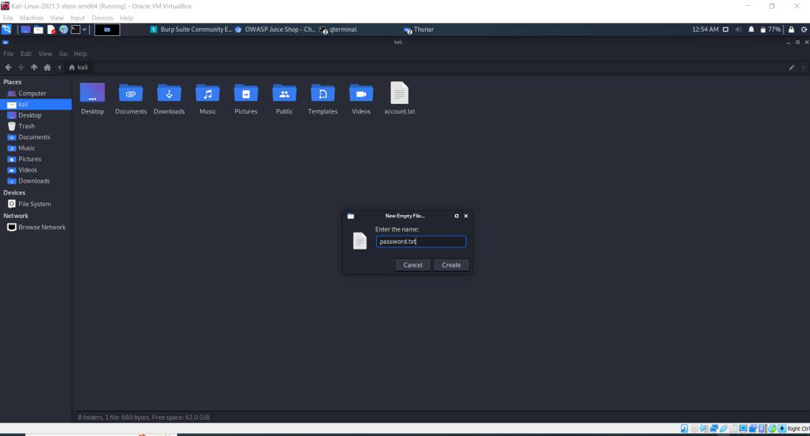

**TUGAS**

**KEAMANAN JARINGAN**

> **"OWASP:BROKEN ACCESS CONTROL"**

{width="2.051388888888889in"
height="1.95in"}

> Nama : Mega Putri Rahmawati Darta
>
> Kelas : D4 LJ IT B
>
> NRP : 3122640038
>
> **POLITEKNIK ELEKTRONIKA NEGERI SURABAYA**

**TAHUN AJARAN 2022/2023**

> **A.PENDAHULUAN**\
> Orang lain dapat mengakses sebuah sistem ketika autentikasi dan
> pembatasan akses tidak diterapkan dengan baik. Dengan kata lain,
> **Broken Access Control** memungkinkan entri yang tidak sah yang dapat
> mengakibatkan kerentanan data dan file yang bersifat sensitif. Kontrol
> akses yang lemah terkait manajemen kredensial dapat dihindari dengan
> metode coding yang unik dan tindakan khusus seperti mematikan akun
> administratif dan penggunaan autentikasi multi-faktor. Berikut ini
> ilustrasi gambaran BAC (Broken Access Control) secara general:
>
> {width="4.272222222222222in"
> height="2.5625in"}
>
> Gambar diatas memperlihatkan orang yang tidak punya akses bisa
> mengakses.
>
> **B.PERCOBAAN**
>
> **a)Mengakses Keranjang Belanja dari User Lain**
>
> 1.Pertama yang harus dilakukan adalah membuka aplikasi burp suite yang
> sudah terpasang pada kali linux. fungsinya sebagai http proxy.
> Aplikasi ini berfungsi untuk mengetrace http yang keluar dan masuk
>
> 
>
> 
>
> 2.Pada aplikasi ini , buka tab "Proxy" kemudian pilih "Intercept" lalu
> klik "Open browser", seperti gambar dibawah ini :
>
> 
>
> 3.Pada terminal masuk ke folder juice-shop yang sebelumnya sudah
> pernah didownload,
>
> kemudian jalankan dengan cara "npm start" dan pada halaman browser
> burp suite tuliskan
>
> url localhost dan port yang menjalankan aplikasi juice shop.
>
> 
>
> 4.Pada web juice shop lakukan registrasi agar bisa login ke web
> tersebut
>
> 
>
> 5.Setelah register, lakukan login ke akun yang sudah didaftarkan
>
> 
>
> 6.Jika berhasil login maka pada menu account akan tampil email yang
> digunakan untuk login
>
> 
>
> 7.Memasukkan beberapa produk kedalam keranjang dengan cara klik "add
> to basket", kemudian cek pada menu "your basket". Disini saya
> memasukkan 3 produk seperti gambar di bawah ini :
>
> 
>
> 8.Pada burpsuite masuk ke tab "Proxy" dan masuk ke "Http History". Dan
> coba lihat method 'post' untuk memastikan jumlahnya sudah sama dengan
> jumlah menambahkan produk.
>
> 
>
> 9.Lalu selanjutnya untuk mengetrace http request dari tampilan
> keranjang, mencari method "GET". Dari gambar di bawah ini dapat
> dilihat pada request sebelah kirim ada mengirimkan id 6, ini merupakan
> id dari keranjang user saya. Kemudian untuk response nya sebelah kanan
> yang merupakan detail isi keranjang sesuai dengan yang diinputkan tadi
> yaitu ada 3 produk.
>
> 
>
> 10.Kemudian selanjutnya masuk ke tab "Repeater" copy request dari
> tahap sebelumnya, salin pada request yang ada di tab "Repeater". Jika
> sudah klik "send" dan akan muncul pop up mengisikan host dan port,
> disini diisikan sesuai host dan port yang digunakan dalam menjalankan
> aplikasi juice shop
>
> 
>
> 11.Berikut merupakan hasil jika sudah berhasil klik "send"
>
> 
>
> 12.Untuk mencoba broken access control , disini saya mencoba untuk
> mengakses id keranjang dari user yang lain. Sehingga saya akan
> mengubah id yang sebelumnya "6" menjadi "5".
>
> Seperti gambar di bawah ini :
>
> 
>
> Dari gambar diatas dapat dilihat, saya dapat melihat produk dari
> keranjang 5 yang berbeda dari produk yang saya inputkan tadi. Disini
> hanya ada 2 produk dengan nama dan kuantitas yang berbeda dari yang
> saya inputkan.
>
> 13.Untuk dapat melihat respon tersebut di juice shop, disini mencoba
> menggunakan fitur dari burpsuite yaitu intercept. Dengan cara masuk ke
> tab "proxy" lalu masuk ke tab "intercept". Jika sudah di halaman
> seperti gambar di bawah ini , klik "intercept of" sehingga nanti akan
> berubah menjadi "intercept on".
>
> 
>
> Setelah menyalakan intercept, buka kembali website juice shop masuk ke
> halaman "home page" dan buka kembali halaman "keranjang".
>
> Lalu buka burpsuite dan klik tombol "forward" hingga pada bagian raw
> muncul header memanggil keranjang id 5. Jika di klik forward lagi,
> maka tampilan website akan berubah menjadi informasi dari keranjang 5
> seperti gambar di bawah ini :
>
> 
>
> **b)Percobaan 2, Control Admin Section**\
> 1.Langkah pertama yang dilakukan adalah mencari tau info email admin,
> dengan cara klik salah satu produk. Disana akan ditampilkan email
> admin seperti gambar di bawah ini :
>
> 
>
> 2.Lalu pada burpsuite tambahkan hostname dan port yang digunakan untuk
> menjalankan juice shop ini kedalam scope, dengan cara masuk ke tab
> "target" lalu pada "site map" klik kalan url dan pilih "add to scope".
>
> 
>
> 3.Jika sudah di klik add to scope maka tampilannya akan menjadi
> seperti ini :
>
> 
>
> 
>
> 4.Langkah selanjutnya adalah menuju ke halaman login dan mengisikan
> email admin dengan password bebas. Namun sebelum klik button "Login"
> saya harus menyalakan intercept seperti cara yang sebelumnya, hal ini
> digunakan untuk tracking.
>
> 
>
> Jika intercept sudah menyala, maka klik "Login"
>
> 
>
> 5.Setelah klik "Login" kembali ke burpsuite dan klik "forward" hingga
> dapat dilihat raw yang menampilkan email dan password.
>
> 
>
> 6.Lalu response ini dikirimkan pada intruder dengan cara "send to
> intruder",seperti gambar di bawah ini :
>
> 
>
> 7.Setelah itu masuk ke tab "intruder" dan pilih tab "positions". Maka
> akan tampil seperti gambar di bawah ini. Kemudian klik "clear" untuk
> membersihkan format dari cookie, berikut perbedaanya :
>
> 
>
> 
>
> Setelah di clear maka akan tampil seperti gambar diatas, langkah
> selanjutnya adalah blok password lalu klik add. Sehingga yang isian
> password menjadi seperti gambar diatas.
>
> 8.Lalu menyiapkan satu file bertipe txt, yang berisikan list password
> yang sering digunakan atau password yang memungkinkan menjadi password
> admin.
>
> 
>
> 9.Isi merupakan list password yang coba saya buat
>
> 
>
> 10.Lalu pada burpsuite klik tab "intruder" dan pilih "payloads", lalu
> upload file txt tersebut hingga muncul pada list. Jika sudah klik
> "start attack".
>
> 
>
> 11.Lalu hasil dari attack adalah gambar dibawah ini, dapat dilihat
> disini yang memiliki status 200 adalag admin123, sedangkan yang
> lainnya memiliki status 401. Hal ini mengartikan bahwa password yang
> benar adalah "admin123"
>
> 
>
> 12.Selanjutnya mencoba login pada juice shop dengan password yang
> sudah dianggap benar tadi , berikut merupakan hasil loginnya :
>
> 
>
> 
>
> Dapat dilihat bahwa saya bisa login akun admin dengan password yang
> tadi di attack pada aplikasi burpsuite.
