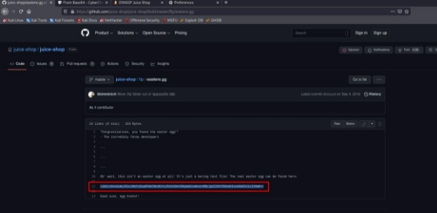

**TUGAS** 

**KEAMANAN JARINGAN                 “OWASP: CYRPTOGRAPHIC FAILURES”** 

Nama : Mega Putri Rahmawati Darta 

Kelas : D4 LJ IT B 

NRP  : 3122640038 

**POLITEKNIK ELEKTRONIKA NEGERI SURABAYA TAHUN AJARAN 2022/2023** 

1. **PENDAHULUAN** 

Kegagalan  Kriptografi  adalah  masalah  keamanan  utama.  Kegagalan  ini  dapat menyebabkan pelanggaran data, pencurian identitas, dan masalah serius lainnya. Dalam OWASP  kegagalan  ini  dapat  dibagi  menjadi  tiga  kategori:  cacat  desain  kriptografi, kesalahan implementasi kriptografi, dan manajemen kunci kriptografi. 

Kegagalan  kriptografi  adalah  saat  penyerang  sering  menargetkan  data  sensitif, seperti  kata  sandi,  nomor  kartu  kredit,  dan  informasi  pribadi,  saat  kita  tidak melindunginya  dengan  benar.  Ini  adalah  akar  penyebab  paparan  data  sensitif. Cryptographic failure  dapat terjadi saat melakukan hal berikut ini: 

1. Simpan atau transit data dalam teks yang jelas (paling umum) 
1. Lindungi data dengan enkripsi lama atau lemah 
1. Filter atau sembunyikan data saat transit dengan tidak benar 

Gambar diatas merupakan scenario serangan cryptographic failure : 

Dalam  skenario  serangan  tersebut,  penyerang  menggunakan  tabel  pelangi  untuk memecahkan hash kata sandi tawar dalam database. Beirkut langkah-langkahnya :  

1. Penyerang mendapatkan akses ke jaringan organisasi. 
1. Penyerang menggunakan application flaw untuk mengambil database kata sandi. 
1. Karena  basis  data  menggunakan  hash  tawar  untuk  mengenkripsi  kata  sandi, penyerang dapat menggunakan tabel pelangi untuk mengekspos kata sandi. 
1. Penyerang menggunakan alat isian kredensial untuk menguji pasangan kredensial di situs web lain. 
2. **PERCOBAAN** 
1) **Nested Easter Egg** 

Easter egg ini merupakan pesan tersembunyi yang telah disiapkan didalam website juice- shop. Berikut merupakan langkah-langkah untuk memecahkan kode enkripsi yang ada didalam juice shop:  

1. Masuk ke dalam direktori ftp di github  

Penjelasan :  

Untuk menuju ke folder ftp, kita harus membuka github dari juice-shop. Jika sudah terbuka  halaman  github  selanjutnya  buka  folder  “ftp”  dan  nmasuk  ke  dalam  file eastere.gg. 

Pada  file  ini  (seperti  gambar  diatas)  diberitahukan  bahwa  file  tersebut  bukan eastere.gg yang asli dan terdapat kode enkripsi yang ditampilkan untuk menemukan easter.gg yang sebenarnya. 

2. Mengartikan kode enkripsi dengan menggunakan cyber chef 

Penjelasan :  

Cyber chef merupakan aplikasi web sederhana untuk menganalisa dan mendekode data dengan cepat, web ini dapat diakses melalui[ link ini.](https://gchq.github.io/CyberChef/) 

Gambar diatas merupakan tampilan dari cyber chef, dimana pada bagian input sudah kami copy kan kode enkripsi yang didapatkan dari file easter.gg. Setelah mengopy kan kode tersebut selanjutnya adalah menentukan recipe pada sebelah kiri. Pada case saat  ini  digunakan Base64 dan  ROT13 untuk  recipenya. Jika sudah akan muncul output di bagian kanan bawah.  

Output tersebut digunakan untuk mengakses suatu link dengan cara dicopykan setelah link juice-shop (localhost:3000). 

3. Akses link hasil dari decode 

Penjelasan :  

Setelah  didapatkan  hasil  dari  kode  yang  ada  di  file  easter.gg,  selanjutnya  jika dijalankan di browser akan tampil seperti gambar diatas.  

2) **Weird Crypto (Cryptographic Issues)** 
1. Membuka customer feedback yang ada didalam juice shop  

Penjelasan  :  untuk  menuju  ke  percobaan,  kita  harus  membuka  halaman  customer feedback yang telah disediakan oleh juice shop. Dengan cara klik button yang ada di kiri atas lalu klik menu “customer feedback” 

2. Mengisikan feedback 

Penjelasan : Pada feedback menginputkan komen “MD5” serta tambahkan rating dan isikan captcha lalu klik “submit” maka akan muncul alert seperti di bawah ini :  

Penjelasan :  

Pada  tantangan  ini  diminta  untuk  menemukan  beberapa  weak  cryptographic algorithm yang sering digunakan untuk melakukan enkripsi data krusial atau data yang seharusnya memiliki keamanan lebih.  

5 weak cryptographic algorithm adalah sebagai berikut :   

1. MD4 / MD5 

Kelemahan dari MD5 adalah mudah di generate, hanya 128 bit, nilai hash nya sama. 

2. RC4 / RC2 
2. DES / 3 DES 
2. Blowfish  
2. SHA-1 

Cryptographic sendiri memiliki 3 jenis sebagai berikut :  

1. Symetri key  : kuncinya sama antara enkrip dan dekrip  
1. Assimetri key  : kuncinya tidak sama perlu pihak ke 3, ada private key dan public key. Contoh : SSL ( Socket Secure Layer ) dan SSH ( Secure Shell ) 
1. Hash : Tidak bisa di refer lagi textnya dan hanya bisa ditebak dikarenakan hanya satu arah
