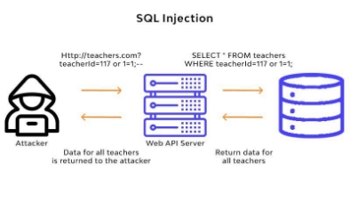
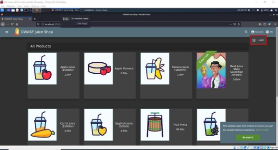
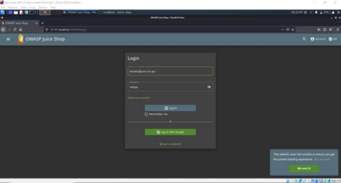
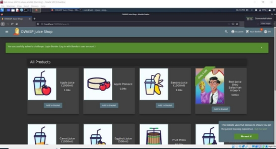
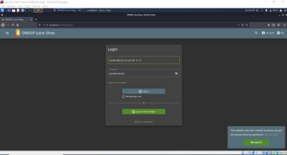

**TUGAS                 KEAMANAN JARINGAN “OWASP:INJECTION”** 

Nama : Mega Putri Rahmawati Darta 

Kelas : D4 LJ IT B 

NRP  : 3122640038 

**POLITEKNIK ELEKTRONIKA NEGERI SURABAYA TAHUN AJARAN 2022/2023** 

1. **PENDAHULUAN** 

SQL Injection adalah salah satu teknik peretasan dengan cara menyalahgunakan celah keamanan  yang  ada  di  lapisan  SQL  berbasis  data  suatu  aplikasi. Terbentuknya  celah tersebut akibat input yang tidak difilter dengan benar dalam pembuatannya, sehingga terciptalah celah yang bisa disalahgunakan.  

SQL  Injection  (SQLi)  merupakan  jenis  serangan  injeksi  yang  memungkinkan  untuk mengeksekusi  statement  SQL  yang  berbahaya.  Statement  yang  digunakan  ini  dapat mengontrol server database di belakang aplikasi web. Hacker dapat melakukan otentikasi dan otorisasi halaman web atau aplikasi web dan mengambil konten dari seluruh database SQL. Mereka juga dapat menggunakan SQL Injection untuk menambah, mengubah, dan menghapus catatan dalam database. Serangan SQL Injection ini dapat menarget semua website yang memanfaatkan SQL database, seperti MySQL, PostgreSQL, SQL Server, dan lainnya. Berikut merupakan gambaran alur SQL Injection :  

2. **PERCOBAAN** 
1. **Login dengan menggunakan karakter command** 

Percobaan ini dilakukan dengan cara login menggunakan akun email[ bender@juice-sh.op ](mailto:bender@juice-sh.op)dengan memanfaatkan sql injection. Berikut langkah-langkahnya :  

1. Masuk ke halaman login , seperti gambar dibawah ini :  

2. Setelah itu menginputkan email bender ke form login, dan menambahkan password terserah/random.  Untuk  dapat  melewati  pengecekan  password  maka  pada  form “email” ditambahkan karakter seperti ini ‘—'. Karena pada SQL  karakter tersebut membatasi perintah, jadi perintah setelah tanda tersebut tidak akan dibaca atau hanya dilewati saja.  

SQL yang sesungguhnya (dijalankan semua) 

**Select  \*  from  user  where  username  =  [“bender@juice-sh.op”](mailto:bender@juice-sh.op)  and password=”password"** 

Dikarenakan ditambahkan karakter – sehingga menjadi seperti ini :  

**Select  \*  from  user  where  username  =  [“bender@juice-sh.op”**](mailto:bender@juice-sh.op)**--  and password=”password" 

3. Maka sudah berhasil login ke akun bender 

2. **Login dengan menggunakan pengkondisian SQL** 

Sama seperti  percobaan 1, pertama yang harus  dilakukan adalah menuju  ke halaman login dan mengisikan email dan password (bebas), seperti gambar dibawah ini :  

1\.  Sedikit berbeda dengan percobaan 1 yang menggunakan karakter command untuk mematikan  perintah  selanjutnya.  Pada  percobaan  ini  menggunakan  perintah pengkondisian,  dimana  ditambahkan  ('  OR  '1'='1)  setelah  email  yang  diinputkan, sehingga isian form menjadi seperti ini :  

Jika  diinputkan  email  seperti  diatas  maka  SQL  yang  dijalankan  adalah  sebagai berikut:  

SELECT  \*  FROM  user  WHERE  username  =  "bender@juice-sh.op"  OR  "1"="1" AND Password="passwordacak" 

Dan terjadi proses perintah SQL sebagai berikut :  

1. Dicek terlebih dahulu apakah username bender memiliki password tersebut, jika password salah maka hasilnya false. 
1. Kemudian  dicek  lagi  apakah   username  =  "bender@juice-sh.op"  OR  "1"="1". Untuk perintah ini langsung menghasilkan true karena 1 memang sama dengan 1. 
1. Sehingga lolos dari pengecekan password 

2\.  Berhasil login ke akun bender menggunakan pengkondisian OR 

