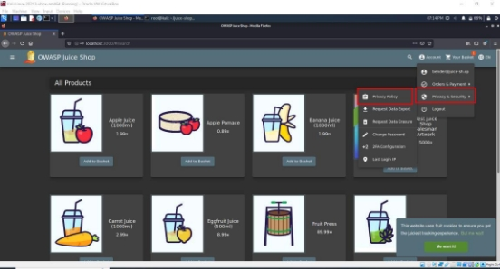
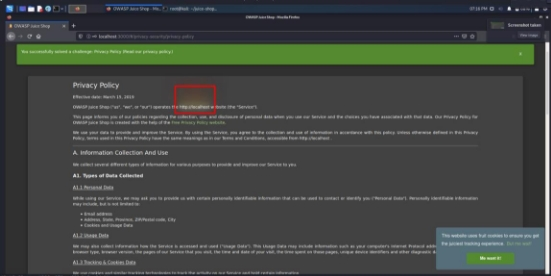
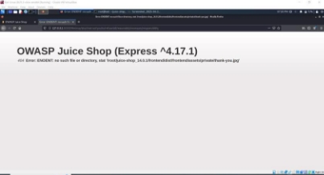

**TUGAS                       KEAMANAN JARINGAN      “OWASP:INSECURE DESIGN”** 

Nama : Mega Putri Rahmawati Darta 

Kelas : D4 LJ IT B 

NRP  : 3122640038 

**POLITEKNIK ELEKTRONIKA NEGERI SURABAYA TAHUN AJARAN 2022/2023** 

1. **PENDAHULUAN** 

Insecure design adalah sebuah representasi kategori yang luas dari banyak kelemahan yang berbeda, yang diekspresikan sebagai "desain kontrol yang tidak ada atau kurang efisien.".  

Salah satu challenge yang termasuk insecure design adalah Security through obscurity (STO).  STO  ini  merupakan  proses  penerapan  keamanan  dalam  suatu  sistem  dengan menegakkan kerahasiaan dan kerahasaiaan arsitektur desain internal sistem. keamanan melalui  ketidakjelasan  berutjuan  untuk  mengamankan  istem  dengan  sengaja menyembunyikan kelemahan keamanannya. 

STO  didasarkan  pada  gagasan  bahwa  sistem  informasi  apapun  selama  kerentanan keamanan  tetap  tersembunyi,  membuat  kecil  kemungkinan  untuk  di  eksploitasi  oleh hacker. Ketidak jelasan berarti merahasiakan celah keamanan sistem yang mendasarinya. Biasanya pendekatan hacker dalam eksploitasi sistem dimulai dengan mengidentifikasi kerentanan. Jika tidak ada informasi kerentanan, peretas akan merasa sistem lebih sulit ditembus dan pada akhirnya akan menunda tujuan jahatnya. 

2. **PERCOBAAN** 

Percobaan yang akan dilakukan kali ini adalah melakukan inspeksi pada halaman privacy policy inspection untuk mendapatkan informasi penting dari halaman tersebut. Berikut merupakan tahapannya :  

1. Masuk ke halaman privacy policy seperti gambar dibawah ini :  

2. Jika sudah di halaman privacy policy, maka akan tampil seperti gambar dibawah ini :  

Pada  halaman  tersebut  ada  beberapa  kata  jika  di  hover  akan  menampilkan  efek kuning  seperti  yang  sudah  saya  kotak  merah.  Kata-kata  tersebut  adalah  sebagai berikut :  

- [http://127.0.0.1 ](http://127.0.0.1/) 
- we may also  
- instruct you  
- to refuse all  
- reasonably necessary  
- responsibility 

Jika  kata-kata  tersebut  digabungkan  menjadi  suatu  URL [http://127.0.0.1:3000/We/may/also/instruct/you/to/refuse/all/reasonably/necessary/res ponsibility ](http://127.0.0.1:3000/We/may/also/instruct/you/to/refuse/all/reasonably/necessary/responsibility)maka dapat ditemukan halaman berikut ini :  

Halaman ini memberitahukan informasi framework yang digunakan beserta dengan versi nya, serta directory structurenya juga.  
