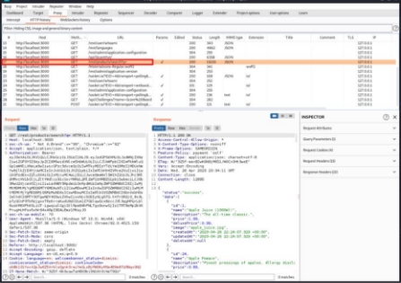
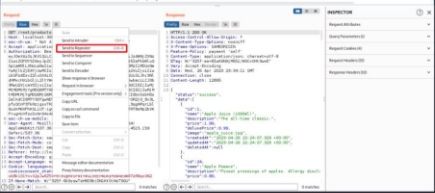
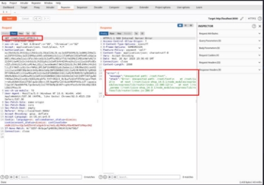
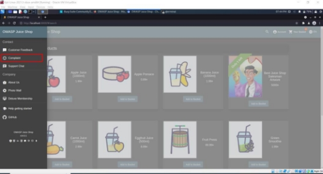
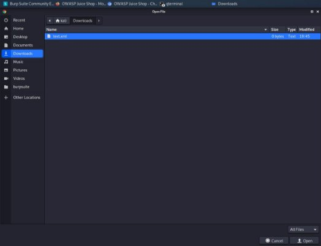
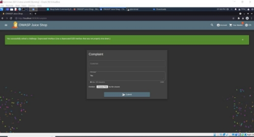
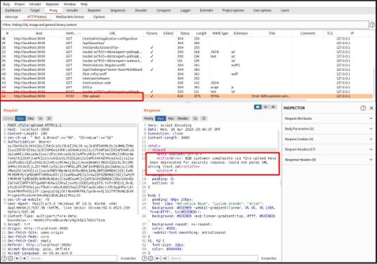

**TUGAS** 

**KEAMANAN JARINGAN                    “OWASP: SECURITY MISCONFIGURATION”** 

Nama : Mega Putri Rahmawati Darta 

Kelas : D4 LJ IT B 

NRP  : 3122640038 

**POLITEKNIK ELEKTRONIKA NEGERI SURABAYA TAHUN AJARAN 2022/2023** 

1. **PENDAHULUAN** 

Security misconfiguration adalah terjadinya suatu kesalahan pada sistem aplikasi web dikarenakan adanya kode program yang salah ataupun sistem melakukan proses yang tidak perlu dilakukan. Berikut merupakan macam-macam security misconfiguration yang berhasil ditemukan pada OWASP. 

2. **PERCOBAAN** 
1. Error Handling 

Percobaan  pertama  kita  akan  melihat  error  handling  yang  ditampilkan.  Pada percobaan ini error handling yang ditampilkan tidak konsisten. Berikut merupakan langkah-langkahnya :  

- Mengaktifkan  burpsuite  untuk  melakukan  pengecekan  message  error  jika dikirimkan suatu endpoint yang tidak tersedia. 

Menjalankan  juice  shop  melalui  browser  burp  suite,  kemudian  melihat  http history  dan  pilih  salah  satu  URL.  Pada  gambat  diatas  saya  memilih  url  yang menampilkan products. 

- Mengirimkan  url  ke  repeater  untuk  bisa  mengubah-ubah  URL  dan  melihat responnya seperti gambar dibawah ini  :  

- Jika  dimasukkan  endpoint  yang  tidak  tersedia  seperti  /rest/text  maka  akan menampilkan error namun errornya memiliki message yang terlalu panjang dan tidak user friendly seperti berikut :  

2. Deprecated Interface 

Percobaan yang kedua menampilkan error dari halaman complain. Dengan langkah- langkah berikut ini :  

- Menuju ke halaman complain dari sidebar seperti gambar dibawah ini :  

- Kemudian mengisikan form complain dan upload 1 file berformat .xml seperti gambar dibawah ini:  

Maka jika disubmit akan tampil challenge berhasil diselesaikan :   

- Pada  burpsuite  dapat  kita  lihat  di  http  history  dengan  url  /file-upload,  disana terdapat error message yang panjang  

