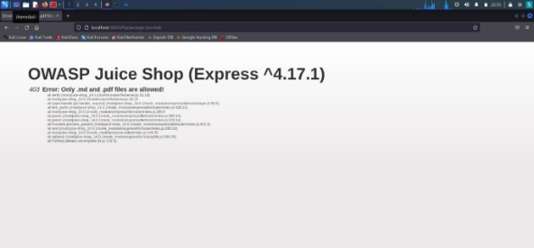
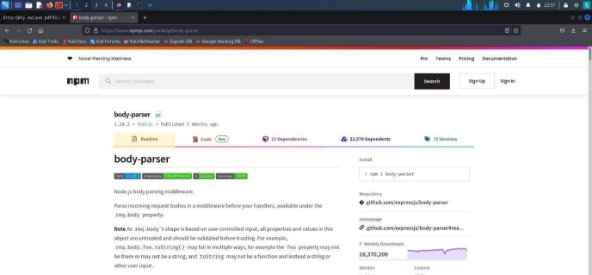

**KEAMANAN JARINGAN OWASP A06 – Vulnerable Component** 

OLEH : 

Mega Putri Rahmawati Darta (3122640038) 

Akhmad Muft Ali Wafa (3122640048) 

PROGRAM STUDI TEKNIK INFORMATIKA             DEPARTEMEN TEKNIK INFORMATIKA DAN KOMPUTER POLITEKNIK ELEKTRONIKA NEGERI SURABAYA 

2022/2023 

Vulnerable Component terjadi Ketika terdapat sebuah komponen yang yang berbahaya, sudah tidak lagi disupport dan komponen yang sudah tertinggal, komponen yang dimaksud adalah OS, server, DBMS, API library dan semua komponen yang terdapat pada aplikasi. 

Untuk mengatasi vulnerable component dapat dilakukan dengan cara : 

1. Menghapus dependensi, fitur, component, file dan dokumen yang tidak diperlukan 
1. Gunakan komponen dari link official atau resmi 
1. Monitoring library dan komponen yang digunakan 

Untuk contoh serangan vulnerable component dapat dilakukan Legacy Typosquatting caranya adalah seperti berikut : 

1. tambahkan /ftp pada path juiceshop yang didalamnya berisikan beberapa file dan folder 

2. buka file package.json.bak 

3. Tambahkan %2500.md pada path url agar file dapat diakses 

4. Buka hasil file yang telah didownload 

5. Cari pada bagian “dependencies” 

6. Buka npmjs untuk melakukan pengecekan pada tiap dependencies apakah terdapat dependencies yang mencurikagan 

7. Disini saya menemukan terdapat dependencies yang mencurigakan yaitu epilogue-js yang dapat dilihat dari isi konten deskripsi pada website npmjs 

Terdapat pesan bahwa library ini bukan library yang ingin dicari dan library ini hanya dibuatuntuk tujuan demonstrasi typosquatting. 

8. Coba masukkan nama dependencies yang mencurigakan tersebut kedalam feedbackjuiceshop 

Dan hasilnya percobaan demonstrasi typosquatting telah selesai 
