**TUGAS                 KEAMANAN JARINGAN** 

**“A07: IDENTIFICATION AND AUTHENTICATION FAILURES”** 

Disusun Oleh kelompok A9 D4 LJ IT B : 

1. Mega Putri Rahmawati Darta (3122640038) 
1. Akhmad Mufti Ali Wafa (3122640048) 

**POLITEKNIK ELEKTRONIKA NEGERI SURABAYA TAHUN AJARAN 2022/2023** 

1. **PENDAHULUAN** 

Identifikasi  dan  autentikasi  membantu  framework  digital  sebagai  pertahanan  awal. Identifikasi  melibatkan  pengatribusian  identitas  untuk  setiap  pengguna  dalam menggunakan layanan aplikasi. Autentikasi mevalidasi sesi pengguna berdasar identitas yang  ditetapkan  dan  kredensial  akses.  Kegagalan  identifikasi  dan  autentikasi  terjadi ketika aplikasi gagal merupakan fungsi yang terkait dengan identitas pengguna, keaslian, dan  manajemen  sesi  dengan  benar.  Kegagalan  ini  sering  digunakan  penyerang  untuk mengambil identitas pengguna, oencurian data, atau kompromi seluruh sistem. 

2. **PERCOBAAN 1** 

Pada  percobaan  ini  akan  mereset  password  dari  akun  OWASP  Bjoern melalui  forgot password dengan menjawab petanyaan keamanan yang diberikan oleh sistem. 

1. Mencari akun dari user bjoern pada review  

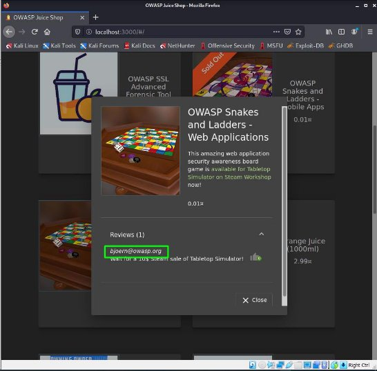

2. Menuju ke halaman login, lalu klik forgot password 

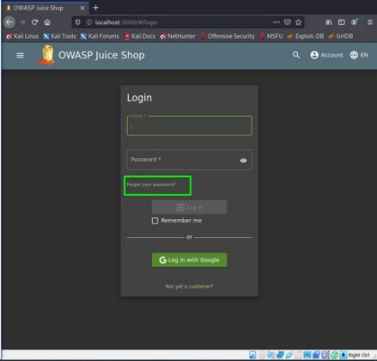

Kemudian diminta untuk melengkapi form berikut :  

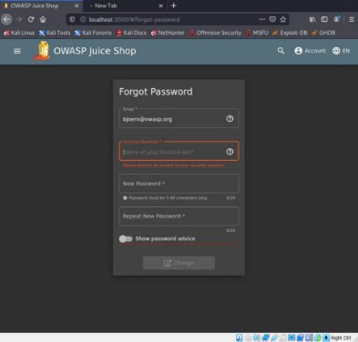

3. Untuk  mengisi  pertanyaan  keamanan  yaitu  hewan  favorite  maka  bisa  mencoba mencari melalui internet :  

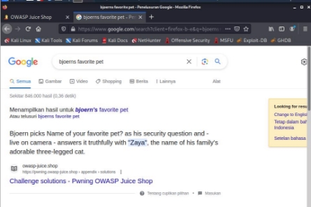

4. Melanjutkan pengisian form, disini saya mengisikan password : bjoern123 

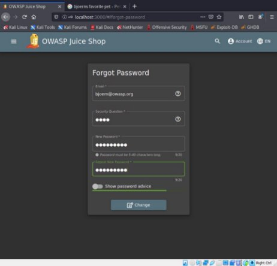

5. Lalu klik “Change” , dan akan tampil berikut ini :  

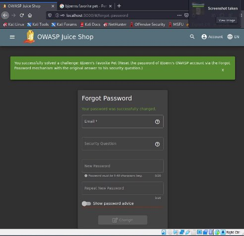

6. Mencoba login dengan password baru  

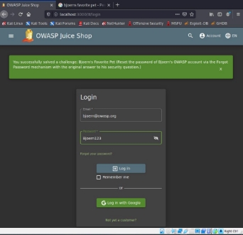

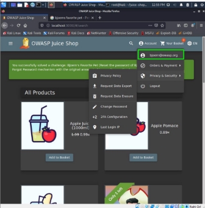

Berhasil login dengan password baru milik akun[ bjoern@owasp.org ](mailto:bjoern@owasp.org)

3. **PERCOBAAN 2** 

Percobaan kedua adalah login dengan user dari administrator tanpa mengubah password saat ini atau menerapkan SQL Injection 

1. Ketik perintah berikut :**  

sqlmap  -u  “http://localhost:3000/rest/user/login”  -- data=“email=test@test.com&password=test”  --level=5  --risk=3  --banner  --  ignore- code=401 --dbms='sqlite' --technique=b 

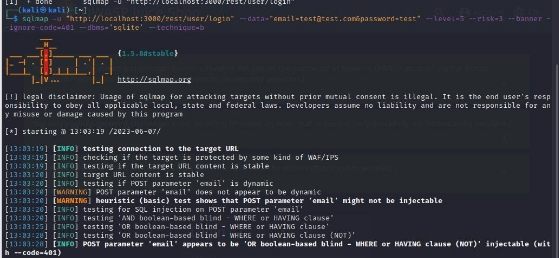

Hasil perintah diatas kode 401, yang berarti autentikasi gagal. 

2. Mengganti perintah dengan menggunakan email admin, sebagai berikut :  

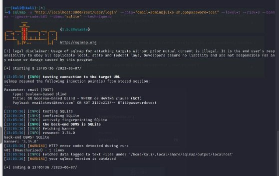

Hasil dari perintah diatas tetap 401 – unauthorize 

3. Mencoba kembali dengan menggunakan password admin123 

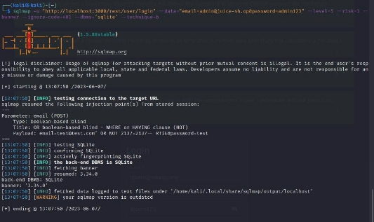

Jika kembali ke juice shop, maka akan muncul pop up berikut yang berarti sukses menjalankan misi. 

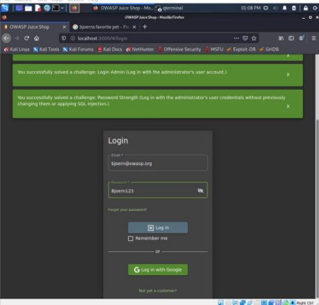
