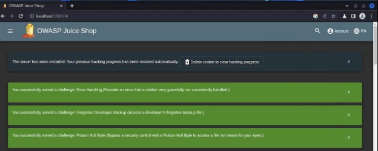
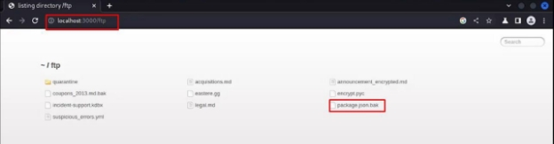
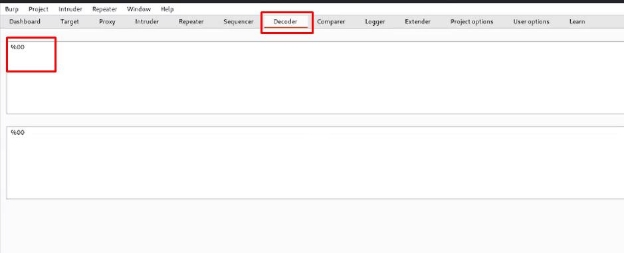
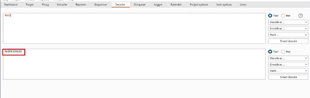
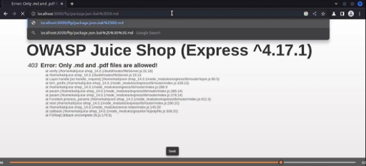
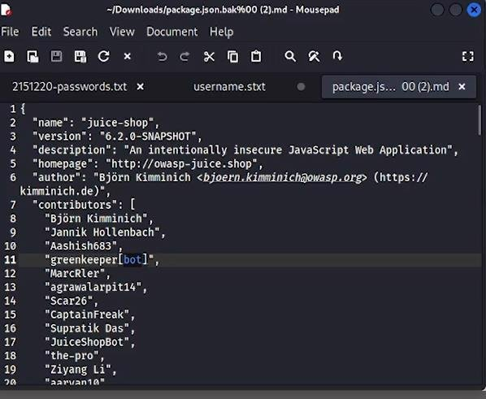

**LAPORAN RESMI** 

**PRAKTIKUM KEAMANAN JARINGAN            SOFTWARE AND DATA INTEGRITY FAILURES** 

**Oleh  :** 

**Mega Putri Rahmawati Darta (3122640038) Akhmad Mufti Ali Wafa (3122640048)** 

**POLITEKNIK ELEKTRONIKA NEGERI SURABAYA TAHUN AJARAN 2023** 

**Software and Data Integrity Failures** 

**Deskripsi** 

Software and data integrity failures dan data terkait dengan kode dan infrastruktur yang tidak melindungi dari pelanggaran integritas. Contohnya adalah saat aplikasi bergantung pada plugin, pustaka, atau modul dari sumber, repositori, dan jaringan pengiriman konten (CDN)  yang  tidak  tepercaya.  Pipeline  CI/CD  yang  tidak  aman  dapat  menimbulkan potensi  akses  tidak  sah,  kode  berbahaya,  atau  penyusupan  sistem.  Terakhir,  banyak aplikasi sekarang menyertakan fungsionalitas pembaruan otomatis, di mana pembaruan diunduh tanpa verifikasi integritas yang memadai dan diterapkan ke aplikasi tepercaya sebelumnya.  Penyerang  berpotensi  mengunggah  pembaruan  mereka  sendiri  untuk didistribusikan dan dijalankan di semua instalasi. Contoh lain adalah di mana objek atau data dikodekan atau diserialkan ke dalam struktur yang dapat dilihat dan dimodifikasi oleh penyerang yang rentan terhadap deserialisasi yang tidak aman. 

Gagalnya  Menjaga  Integritas  Data  dan  Perangkat  Lunak  disebabkan  oleh  kode  dan infrastruktur yang tidak mencegah terjadinya pelanggaran integritas. Contohnya sebuah objek/data yang telah di enkoding/diserialisasi di dalam struktur yang dapat dilihat dan dimodifikasi oleh penyerang yang rentan terhadap deserialisasi yang tidak aman. 

Contoh lainnya adalah aplikasi yang bergantung pada plugins, library, atau modules yang asalnya  dari  sumber  yang  tidak  dipercaya,  repositori  -  repositori,  Content  Delivery Network (CDNs). CI/CD Pipeline yang tidak aman dapat menyebabkan munculnya akses ilegal/tidak sah, kode yang berbahaya, atau kerusakan sistem. 

Terakhir,  aplikasi  sekarang  banyak  yang  memiliki  fitur  pembaharuan  otomatis,  yang dimana pembaharuan - pembaharuan yang ada diunduh tanpa adanya verifikasi integritas dan  diterapkan/digunakan  terhadap  aplikasi  yang  sebelumnya  terpercaya.  Penyerang memiliki  kemungkinan  besar  untuk  mengunggah  pembaharuan  milik  mereka  sendiri untuk di distribusikan dan dijalankan/diterapkan pada semua instalasi/pembaharuan. 

**Percobaan** 

Pada percobaan ini akan menunjukan mengunduh kode tanpa pemeriksaan integritas. 

1. Buka aplikasi juice shop  

2. tambahkan /ftp pada link juiceshop lalu klik package.json.bak 

3. buka burpsuite kemudian menu decoder 

4. masukan %00 

5. lalu lakukan encode as URL 

6. copy hasil encode pada url package.json.bak 

7\.kode telah dapat di unduh  

8\. dan ini adalah isi dari file yang kita unduh  

