**TUGAS                     KEAMANAN JARINGAN    “KERENTANAN PADA VDI”** 

Nama : Mega Putri Rahmawati Darta 

Kelas : D4 LJ IT B 

NRP  : 3122640038 

**POLITEKNIK ELEKTRONIKA NEGERI SURABAYA TAHUN AJARAN 2022/2023** 

**1.  MENGAMBIL DATA DATABASE MENGGUNAKAN SQLMAP** 

Berikut merupakan langkah langkah dari pengambilan database menggunakan sqlmap pada kali linux :  

1. Melakukan cek ip kali linux dengan menggunakan perintah “ifconfig” 

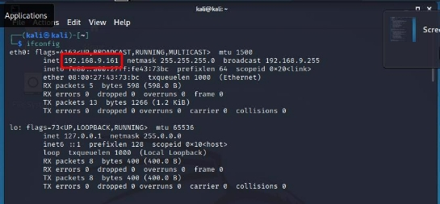

2. Mengecek ssh yang open dan berada pada satu network dengan kali linux, dengan menggunakan perintah nmap sebagai berikut :  

3. Selain  menjalankan  kali  linux,  disini  juga  harus  dijalankan  ubuntu  “Skenario Serangan” 

4. Kemudian  mencoba  kembali  untuk  melihat  ssh  yang  open  dengan  menggunakan perintah step ke 2 diatas.  

Dari gambar diatas didapatkan bahwa ssh dari ubuntu yaitu 192.168.9.148 

5. Mencoba menjalankan ip tersebut pada browser dengan menambahkan /index.php. Maka akan tampil web berikut ini :  

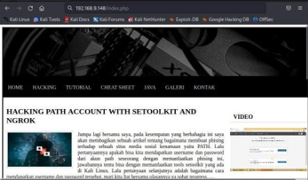

Jika dilihat script dari web tersebut maka didapatkan koneksi database nya, seperti gambar dibawah ini :

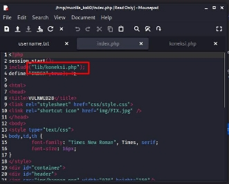

Jika menuju ke 192.168.9.148/lib/koneksi.php, dapat dilihat username, password, dan database yang digunakan seperti berikut :  

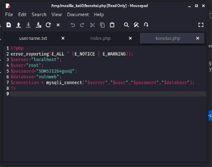

Selain informasi koneksi database, didapatkan juga halaman lainnya seperti menu, konten, sidebar 

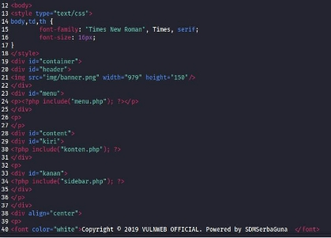

6. Disini  mencoba  untuk  masuk  ke  halaman  konten  “192.168.9.148/konten.php”  :

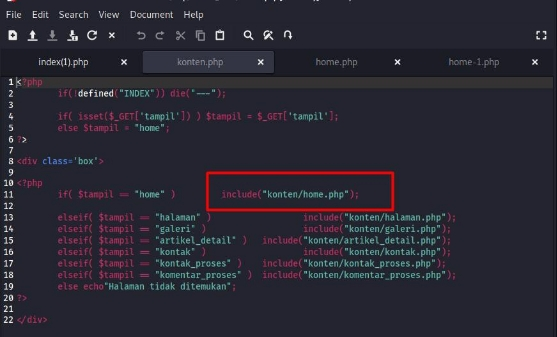

Setelah mengunjungi halaman konten.php, dan jika dilihat pada scriptnya terdapat perintah sql sebagai berikut :  

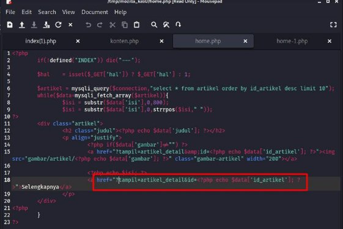

Dengan mendapatkan url memanggil database tersebut, dapat digunakan pada sqlmap. 

7. Menjalankan sqlmap dengan perintah berikut ini :  

Dari  informasi  yang  didapatkan  pada  sqlmap  sudah  sama  dengan  informasi  yang didapatkan dari /lib/koneksi.php 

8. Selanjutnya mengecek tabel apa saja yang ada di dalam database 

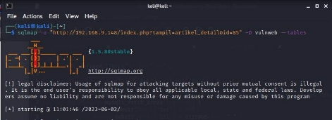

Hasil akhir dari perintah tersebut adalah sebagai berikut :  

Dari informasi diatas didapatkan terdapat 7 tabel dalam database.  

9. Mendapatkan data yang ada didalam tabel :  
1. Tabel User, dengan perintah sebagai berikut :  
- Mencari tahu kolom dari tabel user 

- Hasil dari kolom tabel user  

- Melihat data user 

- Hasil data user  

2. Tabel Artikel 

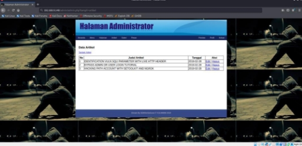

- Mencari tahu kolom dari tabel artikel 

- Hasil dari kolom tabel artikel 

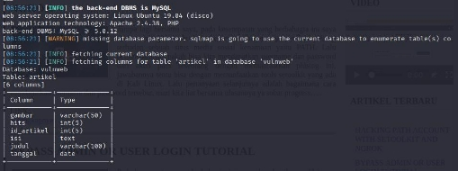

- Melihat data artikel 

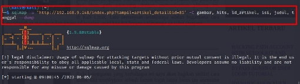

- Hasil data artikel 

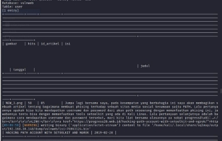

3. Tabel Galeri  

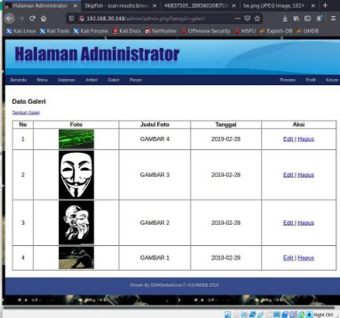

- Mencari tahu kolom dari tabel galeri 

- Hasil dari kolom tabel galeri 

- Melihat data galeri 

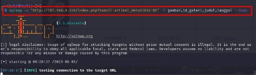

- Hasil data galeri 

4. Tabel Halaman 
- Mencari tahu kolom dari tabel halaman 

- Hasil dari kolom tabel halaman 

- Melihat data halaman 

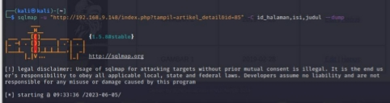

- Hasil data halaman 

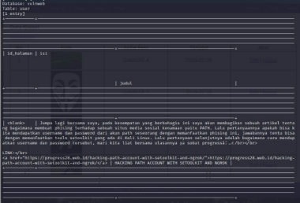

5. Tabel Komentar 
- Mencari tahu kolom dari tabel komentar 

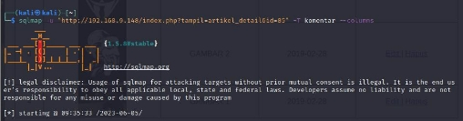

- Hasil dari kolom tabel komentar 

- Melihat data komentar 

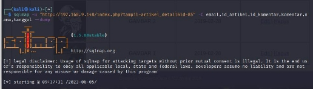

- Hasil data komentar 

6. Tabel Menu 
- Mencari tahu kolom dari tabel menu 

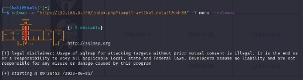

- Hasil dari kolom tabel menu 

- Melihat data menu 

- Hasil data menu 

7. Tabel Pesan 
- Mencari tahu kolom dari tabel pesan 

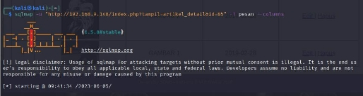

- Hasil dari kolom tabel pesan 

- Melihat data pesan 

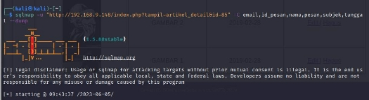

- Hasil data pesan 

Hasil  :  Dari  proses  ini  dapat  disimpulkan  bahwa  telah  berhasil  mengambil  data  dari database dengan menggunakan sqlmap.  

**2.  MENCARI TAU PASSWORD ROOT MENGGUNAKAN HYDRA** 

Langkah yang saya lakukan sebagai berikut :  

- Mencari list username dan password yang nantinya akan dicek kombinasinya dengan hydra: 

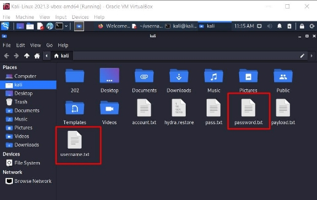

- Menjalankan perintah hydra sebagai berikut :  

- Hasil :  

Belum didapatkan password dan username yang cocok. 
