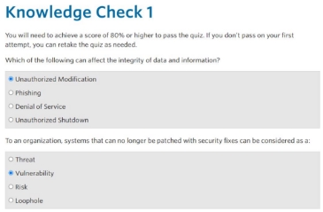
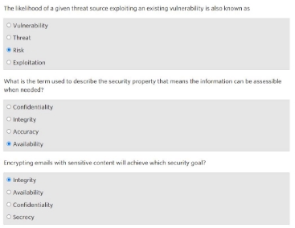
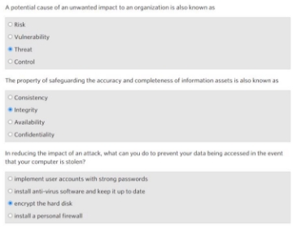
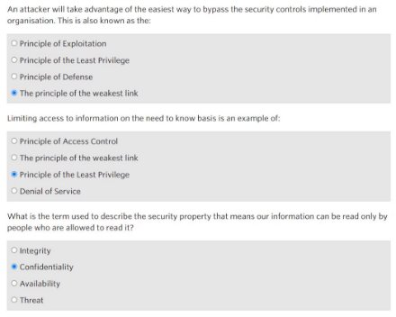
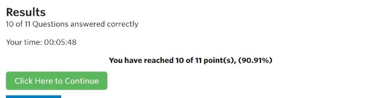

Nama : Mega Putri Rahmawati Darta 

Kelas : D4 LJ IT B 

NRP  : 3122640038 

**Resume Modul 1 . Cyber Security Fundamental**  

1. System Integration : Hal yang berkaitan dalam system adalah efisiensi, realbility, dan security. 
1. Data dan Informasi :  

Data dapat berupa laporan internal, transaksi, data pengguna, desain produk, dan lainnya. Data juga memiliki ancaman seperti modifikasi data tidak valid, kehilangan informasi, akses yang tidak sah. 

Jenis data : 

1. Data diam : Data tidak aktif yang disimpan dalam database 
1. Data bergerak : Data yang melintasi jaringan atau sedang dibaca/diupdate 
3. Tujuan utama keamanan  
   1. Confidentiality (Rahasia)  :  Data  hanya  diungkap  pada  individu  yang  berwenang, contohnya nama pengguna dan password tidak disebarluaskan. 
   1. Integrity (Integritas)  : Menjaga kelengkapan dan keakuratan data. Contohnya email yang diterima/dikirim tidak diubah dari bentuk aslinya. 
   1. Availability (Ketersediaan)   : Data dapat diakses sesuai permintaan oleh yang berwenang. Contohnya layanan email yang harus tersedia setiap saat. 
4. Ancaman, kerentanan, dan risiko  
   1. Ancaman  (thread)  adalah  penyebab  potensial  dari  dampak  yang  tidak  diinginkan  pada sistem.  Dapat  berupa  ancaman  alam,  manusia,  lingkungan  baik  disengaja  maupun kebetulan. Contohnya pemberhentian karyawan dengan data yang masih utuh. 
   1. Kerentanan  (Vulnerability)  adalah  cacat  atau  kelemahan  prosedur  keamanan  sistem, desain,  implementasi,  atau  control  internal  yang  mengakibatkan  pelanggaran  keamanan atau kebijakan keamanan sistem. Contohnya data username dan password tidak dihapus dalam sistem.  
   1. Risiko (Risk) adalah kemungkinan sumber ancaman tertentu yang  menghasilkan dampak buruk. Contohnya dapat mengakses informasi tentang perusahaan 
4. Security Control  
- Kebijakan  prosedur,  contohnya  adalah  kebijakan  keamanan  cyber,  prosedur penanganan insiden. Tujuannya membuat orang sadar akan pentingnya keamanan. 
- Teknis,  contohnya  adalah  firewall,  anti  virus,  sistem  pendeteksi  instruksi.  Tujuan  untuk mencegah dan mendeteksi potensi serangan, mitigasi risiko pelanggaran pada jaringan. 
- Fisik, contohnya adalah cctv, kunci, ruang kerja aman. Untuk mencegah pencurian fisik. 
6. Prinsip Keamanan  
- Prinsip  tautan  terlemah  (weakest  link),  contohnya  lebih  mudah  menebak  kata  sandi dibandingkan dengan mencoba memecahkan sesi jaringan terenkripsi 
- Hak/permission pada role seminimal mungkin (least privilege), contohnya pembatasan hak akses pengguna sehingga jika akun diretas maka akses yang dimiliki juga terbatas.  

**Kesimpulan**  

Tujuan  utama  dari  security  control  ada  3  biasa  disingkat  CIA  (Confidentiality,  Integrity,  Availability). Terdapat 3 hal yang harus dipahami kaitannya yaitu Threat (ancaman), Vulnerability (kelemahan), dan Risk (resiko). Kaitan security control dengan 3 hal tersebut adalah “Cara yang dilakukan dalam control keamanan  adalah  dengan  mengidentifikasi  kelemahan  dan  ancaman  yang  ada,  kemudian  dari identifikasi tersebut kita dapatkan list resiko apa saja yang akan didapatkan. Resiko ini tidak dapat kita hilangkan namun dapat diminimalkan dengan cara security control yaitu membuat kebijakan prosedur, secara teknis seperti memasang antivirus, serta secara fisik seperti memasang cctv.  Adapun prinsip yang digunakan dalam security control adalah weakest link (menebak kata sandi yang mudah), least privilege (memberikan hak seminimal mungkin). 

**Quiz** 

**Hasil** 

**Perbandingan apache, nginx, iis** 

|**Apache** |**NginX** |**IIS** |
| - | - | - |
|Memiliki fitur administrasi |Memiliki fitur server proxy |Memiliki fitur tcp/ip, ftp |
|Keamanan baik |Level keamananan lengkap |Keamanaan kurang baik |
|Menggunakan RAM cukup banyak |Menggunakan RAM sedikit** |Menggunakan RAM terlalu banyak** |
||||

