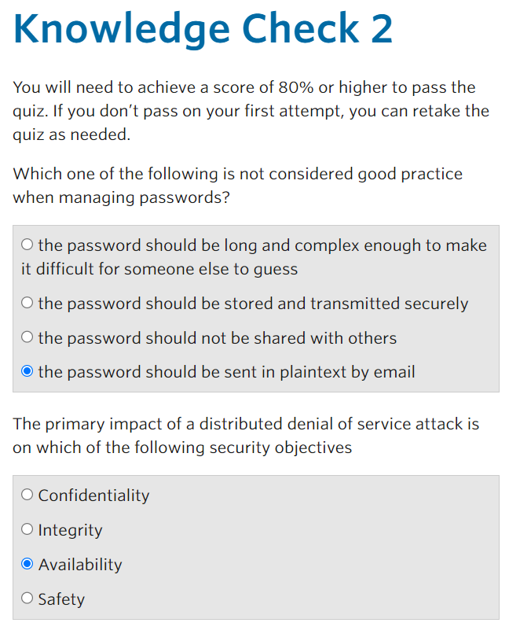
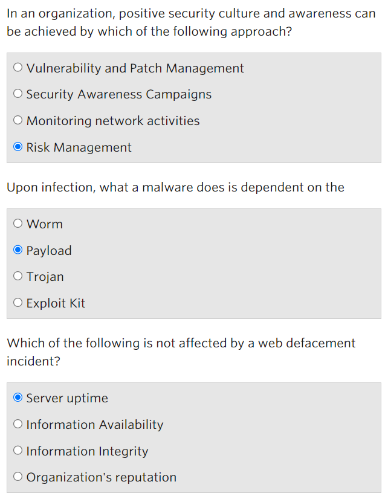
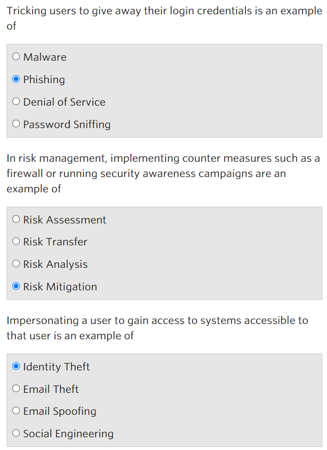
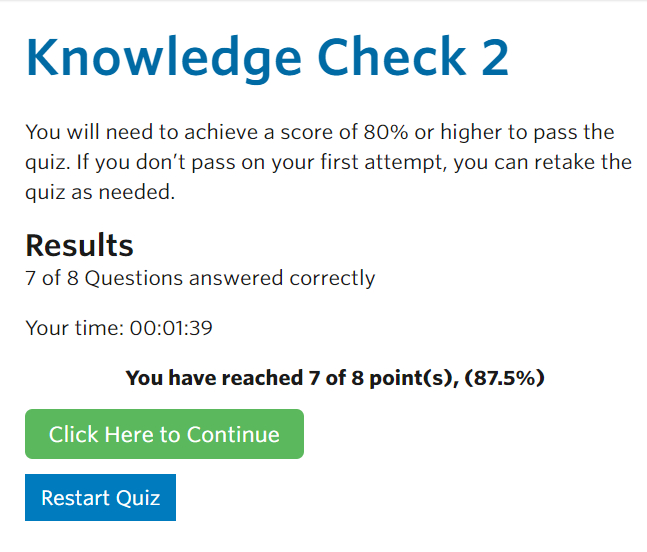

Nama : Mega Putri Rahmawati Darta

Kelas : D4 LJ IT B

NRP : 3122640038

**Modul 2. Cyber Security In The Organization (Keamanan Siber dalam
Organisasi)**

Kemanan ini diperlukan dalam organisasi karena sebuah ancaman dapat
menyebabkan kerugian atau mengganggu kegiatan usaha. Adapun dampak
insiden keamanan terhadap bisnis :

> 1.Operasi bisnis terganggu karena masalah yang berkaitan dengan
> pemasok, kerusakan, infrastruktur, dll.
>
> 2.Biaya operasi meningkat\
> 3.Tidak dapat memberikan layanan berdasarkan kontrak.
>
> 4.Berpengaruh pada citra organisasi

Untuk menghindari dampak tersebut, sebuah organisasi harus dapat
mengidentifikasi dan mengelola resiko yang dapat mengganggu aktivitas
bisnisnya. Pengolahan tersebut dapat dibagi menjadi 2 yaitu :

> 1.Mitigasi : mencegah atau mengurangi resiko dengan menggunakan
> control keamanan 2.Transfer : mengalihkan resiko sehingga ditangani
> oleh entitas lain

Cara untuk meningkatkan keamanan adalah sebagai berikut :

> 1.Menyadari tingkat dan kemungkinan resiko yang memungkinkan
> organisasi untuk lebih proaktif dan siap\
> 2.Pendekatan komprehensif untuk manajemen resiko harus melibatkan
> orang - orang di seluruh organisasi untuk meningkatkan kualitas
> pengambilan keputusan untuk mengelola resiko 3.Biasanya manajemen
> puncak organisasi bertanggung jawab untuk memastikan keamanan
> organisasi\
> 4.Upaya ini akan membutuhkan organisasi untuk menginvestasikan sumber
> daya ( uang, waktu, dan manusia ) dan mengembangkan program keamanan
> siber yang komprehensif

Ancaman umum yang sering terjadi pada organisasi adalah :

> 1.Denial of Sevice\
> Dilakukan melalui jaringan dengan mengirimkan banyak paket jaringan,
> lebih dari apa yang dapat dilakukan oleh server atau peralatan
> jaringan.
>
> 2.Identify Theft\
> Pencurian identitas terjadi ketika penyerang mencuri identitas user
> sehingga mereka dapat menyamar sebagai user dan dapat mengakses ke
> sistem. Contohnya adalah phising, kegiatan menipu user untuk
> memberikan kredensial masuk.
>
> 3.Malware
>
> Salah satu bentuk software yang dibuat dengan tujuan merusak sistem,
> atau sekedar masuk sistem komputer, jaringan hingga server. Setelah
> itu baru akan menjalankan payload yaitu : - Merekam apa yang diketik
> pengguna\
> - Mengirim informasi\
> - Mengenkripsi file lokal
>
> 4.Web Defacement\
> Kerusakan web terjadi ketika konten situs web dimodifikasi oleh
> penyerang. Terjadi karena kerentanan dalam perangkat lunak dan dapat
> menyebabkan tidak tersedianya layanan.

Cara untuk mengurangi resiko serangan siber :

> 1.Kontrol teknis untuk pencegahan\
> Misalkan firewall, sistem deteksi intrusi, spam filter, dan perangkat
> lunak anti-virus.
>
> 2.Pendidikan dan pelatihan tenagakerja\
> Terutama ketika berhadapan dengan phising dan bagaimana mengembangkan
> aplikasi website dengan aman.
>
> 3.Sistem pendukung\
> Memastikan bahwa penyedia jaringan dapat memberikan bantuan ketika ada
> serangan keamanan.

