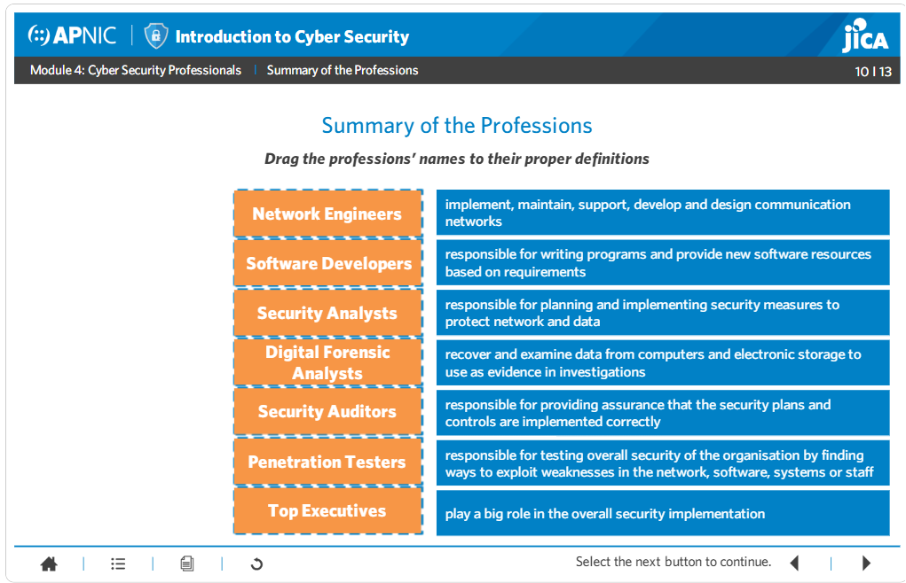

**TUGAS**

**KEAMANAN JARINGAN**

**"PROFESI IT"**

{width="2.051388888888889in"
height="1.95in"}

> Nama : Mega Putri Rahmawati Darta
>
> Kelas : D4 LJ IT B
>
> NRP : 3122640038
>
> **POLITEKNIK ELEKTRONIKA NEGERI SURABAYA**

**TAHUN AJARAN 2022/2023**

> {width="6.5in"
> height="4.188888888888889in"}
>
> **Suitable profession and dream profession**
>
> Based on the knowledge that I currently have, I feel that of the above
> professions that best suit me and become my dream profession is a
> software developer. The following is a further explanation about
> software developers :
>
> a.Software developer job\
> 1.Modify software to fix bugs, adapt new hardware, and to improve
> performance 2.Develop and direct software system testing and
> validation procedures, programming, and documentation\
> 3.Collaborate with system analysts, programmers, and other workers to
> design systems and applications\
> 4.Analyze user requirements and software requirements to determine
> design feasibility 5.Design, develop, and modify software systems
> using scientific analysis and mathematical models\
> 6.Maintenance of existing systems by monitoring and correcting errors\
> 7.Meet clients and project managers to design and build new systems\
> 8.Designing, writing, reading, testing, and fixing code for new
> software\
> 9.Documenting the latest updates for each software
>
> b.Required skills\
> 1.Able to master several programming languages required 2.Problem
> solving ability\
> 3.Cooperation\
> 4.Work is not half measures\
> 5.Detail oriented\
> 6.Understanding of software security
>
> c.Career path\
> Almost all companies today use software systems. This is what makes a
> software developer able to work in various industries. The software
> developer career path starts with becoming a senior software
> developer, after that you can choose to take a computer architect or
> engineering manager. After becoming a senior software developer, you
> can immediately become an engineering manager. You can even become a
> software architect or director or project manager.
>
> d.Software Developer Certification\
> Other certifications that will help you get this job include
> Capability Maturity Model Integration, Microsoft Certified Systems
> Engineer, and Microsoft SQL Server, as well as: 1.C++ CERTIFICATION,
> C++ Institute:\
> C Programming Language Certified Association (CLA)\
> C Certified Professional Programmer (CLP)\
> Certified Senior Programmer (CLS)\
> C++ Certified Associate Programmer (CPA)\
> C++ Certified Professional Programmer (CPP)\
> C++ Certified Senior Programmer (CPS)\
> 2.IEEE PROFESSIONAL SOFTWARE DEVELOPER CERTIFICATION (PSD) 3.IEEE
> PROFESSIONAL SOFTWARE ENGINEERING PROCESS MASTER CERTIFICATION
> (PSEPM)\
> 4.IEEE SOFTWARE ENGINEERING MASTER CERTIFICATION (PSEM)\
> 5.MICROSOFT CERTIFIED SOLUTIONS DEVELOPER (MCSD)
