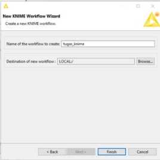
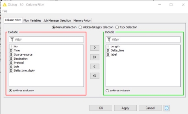

**TUGAS                 KEAMANAN JARINGAN “DATA MINING”** 

Nama : Mega Putri Rahmawati Darta 

Kelas : D4 LJ IT B 

NRP  : 3122640038 

**POLITEKNIK ELEKTRONIKA NEGERI SURABAYA TAHUN AJARAN 2022/2023** 

1. Installasi Wireshark  

2. ‘Installasi Knime 

3. Untuk mempermudah pada saat proses analisa yang akan dilakukan nantinya, kita akan mengambil data dengan ip versi 4 (ipv4) dan protocol TCP, DNS saja. Untuk proses tersebut dapat dilakukan pada wireshark menggunakan perintah ip.version==4 && tcp || dns pada kolom display filter tepat dibawah toolbar 

4. Menambahkan kolom baru  

5. Hasil penambahan kolom  

6. Langkah terakhir yaitu export file pcap tersebut keformat Comma-separated Value (.csv) dengan cara klik File – Export Packet Dissections – As CSV. Yang perlu diperhatikan yaitu pada Pacet Range, pastikan yang terpilih yaitu Displayed, karena data pada Displayed ini sudah terfilter denga nip version 4. 

\*saya hanya menggunakan 1 file 

7. Buka software knime untuk melakukan proses analisa pada traffic DNS. Berikut adalah file yang telah. Terdapat bagian-bagian penting sebagai berikut :  
   1. Yang pertama yaitu Knime Explorer yang isinya adalah project project yang kita buat pada software ini 
   1. Terdapat Node Repository, bagian ini merupakan bagian yang sangat penting, karena berisi seluruh fungsi tools dari software ini yang dinamakan dengan Node. 
   1. Knime Workflow, bagian ini adalah bagian visual pada Knime, seluruh fungsi yang digunakan akan ditampilkan pada bagian ini. Berikut adalah contoh tampilan pada Knime Workflow 
7. Setelah  mengenal  semua  bagian  dari  Knime.  Setelah  itu  kita  akan  membuat workflow/project baru. Dengan cara klik File – New – New Knime Workflow – Tulis Nama workflow dan Lokasi workflow tersebut – Klik Finish 

9. Selanjutnya yaitu menggabungkan seluruh data tadi menjadi 1 data. Node yang dibutuhkan untuk proses ini yaitu :  
1. File Reader : untuk membaca data  
1. Concatenate : untuk menggabungkan data 
- Membuat file reader dan menginputkan file yang digunakan 

- Berikut tampilannya (disini saya hanya menggunakan 1 file dataset saja) 

- Menjalankan concatenate, dengan cara klik kanan pada note → execute. Bila berhasil dijalankan status node akan berubah menjadi hijau. 

- Menambahkan tabel baru  

- Menambahkan dan setting joiner 

- Excecute joiner 

- Menampilkan tabel hasil joiner, terdapat label yang masih berisi “?” 

10. Menggunakan missing value untuk mengisi data kosong  

11. Menggunakan value counter untuk melihat jumlah  

12. Export file ke dalam .csv 

13. Proses cleaning 
- Membuat dan memasukkan data dalam file reader 

- Konfigurasi Filter  

- Konfigurasi missing value  

- Excecute data 

14. Data Transformation  
- Menambahkan normalizer 

- Konfigurasi normalizer 

- Excecute normalizer 

15. Data Mining  
- Menambahkan proses seperti ini  

- Konfigurasi x-partitioner 

- Konfigurasi decision tree 

- Konfigurasi decision tree predictor 

- X-aggregator tanpa konfigurasi, dan berikut hasilnya :  

16. Evaluation  
- Menambahkan score dengan konfigurasi berikut :  

- Melihat akurasi**  

